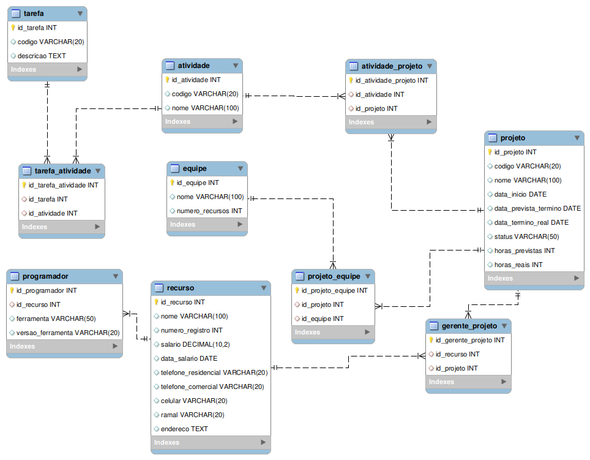

# Atividade 09 - Modelagem de Bancos de Dados

Estudo de caso da multinacional I&T SOLUTIONS

## Criação do Modelo Lógico e Físico

O modelo lógico e físico foram criados com a ferramenta gerencimento de banco de dados mysql workbench.

## Imagem Modelo Lógico

<h1>Guia de Instalação e Configuração do MySQL Community Server e MySQL Workbench</h1>

Este documento fornece instruções para instalar e configurar o MySQL Community Server e o MySQL Workbench em sistemas operacionais populares.

<h2>Índice</h2>
<ul>
    <li><a href="#pré-requisitos">Pré-requisitos</a></li>
    <li><a href="#instalação-do-mysql-community-server">Instalação do MySQL Community Server</a>
        <ul>
            <li><a href="#windows">Windows</a></li>
            <li><a href="#macos">macOS</a></li>
            <li><a href="#linux">Linux</a></li>
        </ul>
    </li>
    <li><a href="#instalação-do-mysql-workbench">Instalação do MySQL Workbench</a>
        <ul>
            <li><a href="#windows-1">Windows</a></li>
            <li><a href="#macos-1">macOS</a></li>
            <li><a href="#linux-1">Linux</a></li>
        </ul>
    </li>
    <li><a href="#configuração-inicial-do-mysql">Configuração Inicial do MySQL</a></li>
    <li><a href="#conexão-com-o-mysql-workbench">Conexão com o MySQL Workbench</a></li>
    <li><a href="#recursos-adicionais">Recursos Adicionais</a></li>
</ul>

<h2 id="pré-requisitos">Pré-requisitos</h2>
<ul>
    <li>Acesso à internet.</li>
    <li>Permissões de administrador para instalação.</li>
    <li>Sistema operacional compatível (Windows, macOS ou Linux).</li>
</ul>

<h2 id="instalação-do-mysql-community-server">Instalação do MySQL Community Server</h2>

<h3 id="windows">Windows</h3>
<ol>
    <li>Baixe o instalador do MySQL Community Server <a href="https://dev.mysql.com/downloads/mysql/">aqui</a>.</li>
    <li>Execute o instalador e siga as instruções na tela.</li>
    <li>Escolha o tipo de instalação (típica é recomendada).</li>
    <li>Configure a senha do usuário <code>root</code> quando solicitado.</li>
    <li>Finalize a instalação.</li>
</ol>

<h3 id="macos">macOS</h3>
<ol>
    <li>Baixe o arquivo DMG do MySQL Community Server <a href="https://dev.mysql.com/downloads/mysql/">aqui</a>.</li>
    <li>Abra o arquivo DMG e siga as instruções para arrastar o MySQL para a pasta Aplicativos.</li>
    <li>Utilize o Terminal para iniciar o MySQL com o comando:
        <pre><code>sudo /usr/local/mysql/support-files/mysql.server start</code></pre>
    </li>
    <li>Configure a senha do usuário <code>root</code> se solicitado.</li>
</ol>

<h3 id="linux">Linux</h3>
<ol>
    <li>Abra o terminal e adicione o repositório MySQL:
        <pre><code>sudo apt update
sudo apt install mysql-server</code></pre>
    </li>
    <li>Inicie o serviço MySQL:
        <pre><code>sudo systemctl start mysql</code></pre>
    </li>
    <li>Execute o script de segurança:
        <pre><code>sudo mysql_secure_installation</code></pre>
        Siga as instruções para configurar a senha do usuário <code>root</code>.
    </li>
</ol>

<h2 id="instalação-do-mysql-workbench">Instalação do MySQL Workbench</h2>

<h3 id="windows-1">Windows</h3>
<ol>
    <li>Baixe o MySQL Workbench <a href="https://dev.mysql.com/downloads/workbench/">aqui</a>.</li>
    <li>Execute o instalador e siga as instruções na tela.</li>
</ol>

<h3 id="macos-1">macOS</h3>
<ol>
    <li>Baixe o MySQL Workbench <a href="https://dev.mysql.com/downloads/workbench/">aqui</a>.</li>
    <li>Abra o arquivo DMG e arraste o MySQL Workbench para a pasta Aplicativos.</li>
</ol>

<h3 id="linux-1">Linux</h3>
<ol>
    <li>Abra o terminal e adicione o repositório MySQL:
        <pre><code>sudo apt update
sudo apt install mysql-workbench</code></pre>
    </li>
    <li>Inicie o MySQL Workbench pelo menu de aplicações ou digitando <code>mysql-workbench</code> no terminal.</li>
</ol>

<h2 id="configuração-inicial-do-mysql">Configuração Inicial do MySQL</h2>

Após a instalação do MySQL Community Server:

<ol>
    <li>Abra o terminal ou prompt de comando.</li>
    <li>Acesse o MySQL como usuário root:
        <pre><code>mysql -u root -p</code></pre>
    </li>
    <li>Insira a senha configurada durante a instalação.</li>
    <li>Para verificar se o MySQL está funcionando, execute:
        <pre><code>SHOW DATABASES;</code></pre>
    </li>
</ol>

<h2 id="conexão-com-o-mysql-workbench">Conexão com o MySQL Workbench</h2>

<ol>
    <li>Abra o MySQL Workbench.</li>
    <li>Clique em "Local Instance MySQL".</li>
    <li>Insira a senha do usuário <code>root</code> quando solicitado.</li>
    <li>Você agora pode criar e gerenciar suas bases de dados através da interface do Workbench.</li>
</ol>

<h2 id="recursos-adicionais">Recursos Adicionais</h2>
<ul>
    <li><a href="https://dev.mysql.com/doc/">Documentação do MySQL</a></li>
    <li><a href="https://dev.mysql.com/doc/workbench/en/">MySQL Workbench: Guia do Usuário</a></li>
    <li><a href="https://forums.mysql.com/">Comunidade MySQL</a></li>
</ul>

<h2>Desenvolvedor</h2>

[ Michel L. Sampaio](https://github.com/devlavanere)
